# SPFx Intranet Suite

Open-source SharePoint Framework (SPFx) web parts that fill the gaps left by the
out-of-the-box modern SharePoint toolbox. These are the small, practical building
blocks most intranets end up rebuilding by hand.

One solution, one package, many web parts. Install once and get the whole set.
SPFx lazy-loads each web part's bundle, so an unused web part costs a page nothing.

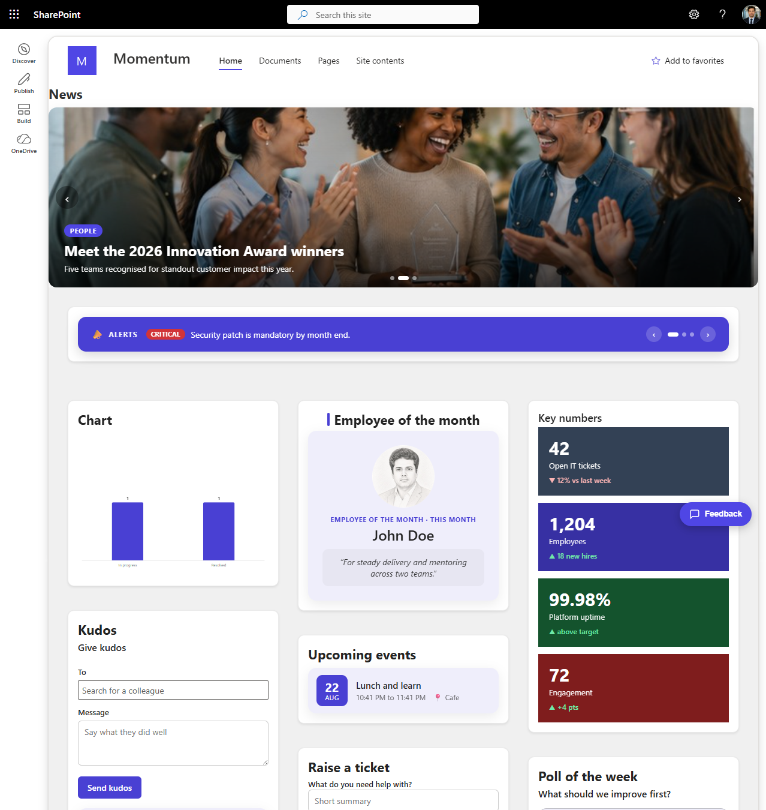

## Web parts

| Web part | What it does | Source |
| --- | --- | --- |
| **Announcements Ticker** | A rotating band of announcements with Info / Warning / Critical severity. | Announcements list |
| **Raise a Ticket** | A help-request form that writes to a list, plus the person's recent tickets. | Tickets list |
| **Kudos** | A recognition wall plus a people-picker form to thank a colleague. | Kudos list |
| **Employee of the Month** | A spotlight card with the person's profile photo, month and citation. | EmployeeOfMonth list |
| **Quick Links** | A grid of shortcut tiles with icons. | QuickLinks list |
| **KPI Tiles** | A row of key-number tiles with a trend arrow and delta. | KPIs list |
| **FAQ Accordion** | An expandable list of questions and answers. | FAQ list |
| **Upcoming Events** | Date-badged cards for events from today onward. | Events calendar |
| **Image Gallery** | A photo grid with an in-page lightbox. | IntranetGallery library |
| **News Carousel** | A rotating hero of featured stories. | News list |
| **Event Countdown** | A live countdown to an event you set. | Property pane |
| **Upcoming Holidays** | Date-badged upcoming public holidays. | Holidays list |
| **Poll** | A one-question poll with live result bars. | PollVotes list |
| **People Directory** | Search your organisation for a colleague. | People search |
| **Content Rollup** | Recent news, read from a list you choose or rolled up from search. | News list or search |
| **Org Chart** | Your manager, you, and your direct reports. | User profiles |
| **Chart from a List** | A bar chart built from a list, grouped by a column. | Any list |
| **Celebrations** | Upcoming birthdays and work anniversaries. | Celebrations list |
| **Tabs** | A tabbed container grouping a list's items into tabs. | Any list |
| **Weather** | Current weather and a 3-day forecast for a location. | open-meteo API |
| **Greeting** | A time-based greeting for the signed-in user, with quick-stat chips. | Signed-in user |

Every web part ships with sample data on by default, so it renders the moment you
drop it on a page. Point it at a list, or turn on live data, when you are ready.
People Directory and Org Chart use the site's own search and user profile services,
so they need no extra admin consent.

## Site-wide extensions

Two Application Customizers add chrome to every page in a site, not just one web part.

| Extension | What it does | Source |
| --- | --- | --- |
| **Intranet Header** | A full-width band at the top of every page: brand (logo or text), an inline top nav, and an optional call-to-action button. The current page's nav item is highlighted. | HeaderLinks list |
| **Intranet Footer** | A slim full-width footer bar on every page, revealed when the page is scrolled to the bottom, with brand, links, social icons and a copyright line. | FooterLinks list |
| **Feedback** | A fixed feedback bubble in the bottom-right corner: a rating, a comment, and an optional "OK to follow up" so the site owner can reply. | Feedback list |

Enable them per site after the package is installed. Each is idempotent and theme-accent aware:

```powershell
.\deploy\Enable-Header.ps1  -Url "https://contoso.sharepoint.com/sites/intranet" -ClientId "<app-id>" -BrandText "Contoso" -LogoUrl "/sites/intranet/SiteAssets/logo.png" -Accent "#0f6cbd" -CtaText "Raise a ticket" -CtaUrl "/sites/intranet/support"
.\deploy\Enable-Footer.ps1  -Url "https://contoso.sharepoint.com/sites/intranet" -ClientId "<app-id>" -BrandText "Contoso" -Accent "#0f6cbd"
.\deploy\Enable-Feedback.ps1 -Url "https://contoso.sharepoint.com/sites/intranet" -ClientId "<app-id>" -Accent "#0f6cbd"
```

## Screenshots

A look at the web parts. Every one ships with sample data on by default, so these render before you wire up any list.

| | | |
| --- | --- | --- |
| **Announcements Ticker**<br>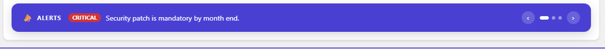 | **Content Rollup**<br>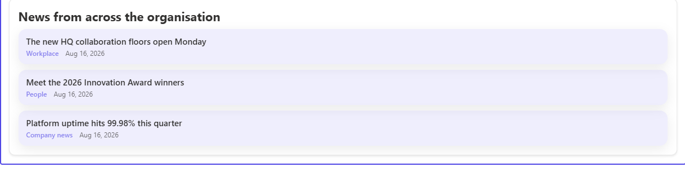 | **KPI Tiles**<br>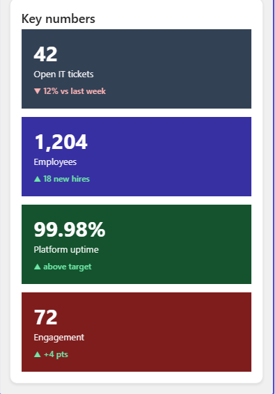 |
| **Chart from a List**<br>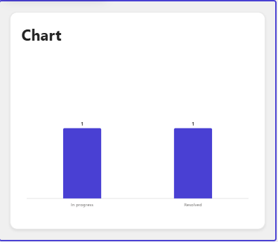 | **Poll**<br>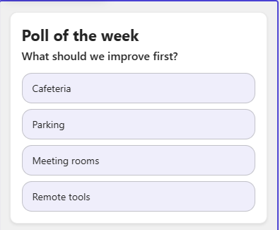 | **Kudos**<br>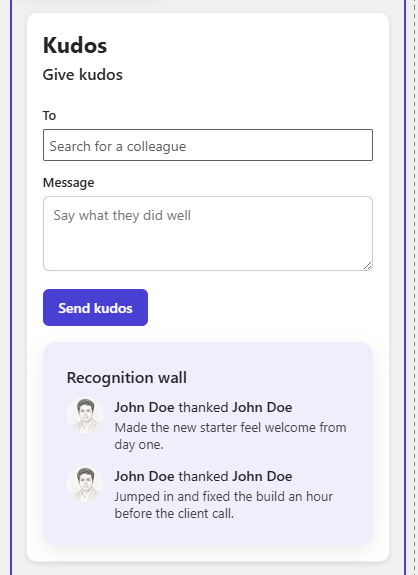 |
| **Employee of the Month**<br> | **Celebrations**<br>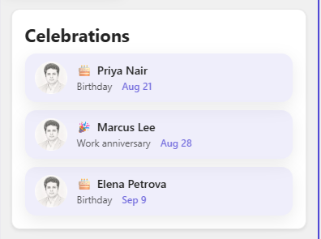 | **Upcoming Events**<br>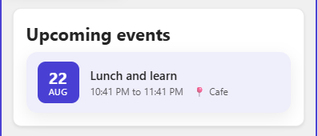 |
| **Event Countdown**<br>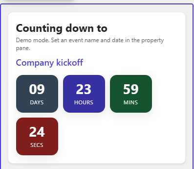 | **Upcoming Holidays**<br>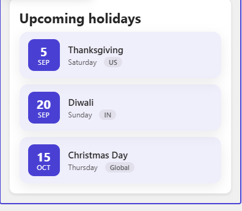 | **Raise a Ticket**<br>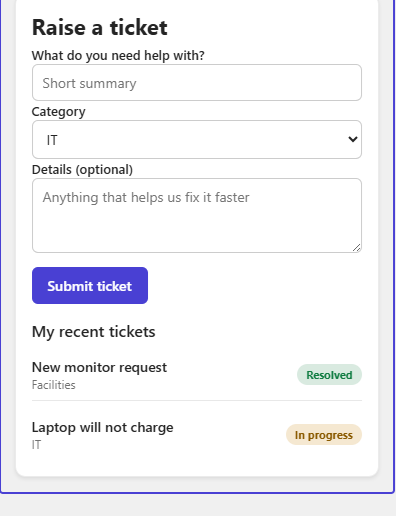 |
| **FAQ Accordion**<br>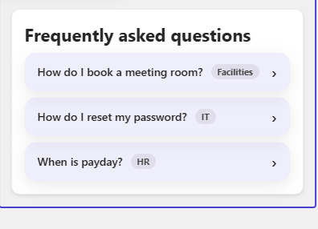 | **Quick Links**<br>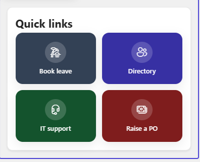 | **Tabs**<br>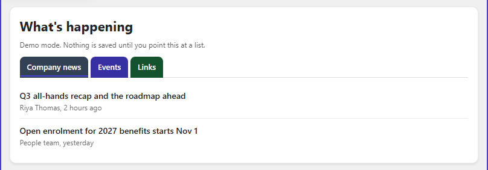 |
| **Image Gallery**<br>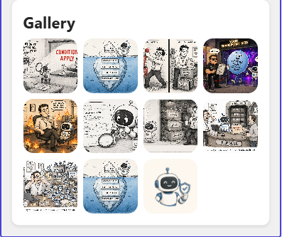 | **Weather**<br>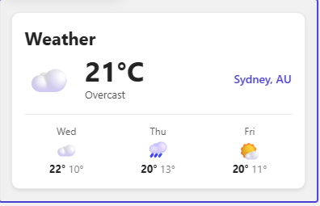 | **Site header** (with an owner settings panel)<br>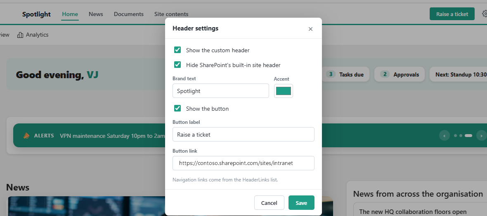 |

A full write-up of each web part, with how to wire it to a list, is on the blog at [fivenumber.com](https://www.fivenumber.com).

## Shared options on every web part

- **Layout style**: Card, Minimal, Bold, or Compact, so the same web part can match
  different page designs without forking the code.
- **Container**: show or hide the title, show or hide a border, and set the
  background (transparent, white, light grey, accent tint, or a custom colour).
- **Reset to default**: one button restores every property to its shipped default.
- **Avatar** (where a person shows): choose a profile photo (with initials as a
  fallback) or always show initials.
- **Theme aware**: colours follow the site theme. Messages use a soft, muted tone,
  never a harsh red.

## Requirements

| Tool | Version |
| --- | --- |
| Node.js | v22 LTS (SPFx 1.21.x is not compatible with Node 20) |
| SPFx generator | `@microsoft/generator-sharepoint@1.21.1` |
| SharePoint | SharePoint Online |
| PnP.PowerShell | 3.x (only for the provisioning script) |

## Build and package

```bash
npm install
gulp bundle --ship
gulp package-solution --ship
# -> sharepoint/solution/spfx-intranet-suite.sppkg
```

Upload the `.sppkg` to your tenant App Catalog (or a site-collection App Catalog),
then add the web parts to a page. They appear under the **Intranet Suite** group in
the toolbox.

## Provision the lists

The web parts read from a set of SharePoint lists and one library. The included
script creates them all, with columns and sample data, on any site. It is
idempotent, so existing lists and fields are left alone.

```powershell
.\deploy\Provision-IntranetLists.ps1 -Url "https://contoso.sharepoint.com/sites/intranet"
# schema only, no sample rows:
.\deploy\Provision-IntranetLists.ps1 -Url "https://contoso.sharepoint.com/sites/intranet" -NoSampleData
```

## Optional: build a demo home page

`deploy/Build-HomePages.ps1` rebuilds a site's home page and drops the web parts
into a ready-made layout, so you can see the whole suite at once. `Set-SiteNav.ps1`
sets the top navigation to a sample menu.

```powershell
# default layout (all web parts, one column + sidebar):
.\deploy\Build-HomePages.ps1 -Url "https://contoso.sharepoint.com/sites/intranet" -ClientId "<app-id>" -Variant card -RealData
# a curated, magazine-style front page:
.\deploy\Build-HomePages.ps1 -Url "https://contoso.sharepoint.com/sites/intranet" -ClientId "<app-id>" -Variant card -Card -RealData -Layout spotlight
# sample top navigation:
.\deploy\Set-SiteNav.ps1 -Url "https://contoso.sharepoint.com/sites/intranet" -ClientId "<app-id>"
```

Rebuilding the home page replaces its contents, so run it on a demo site, not a
page you have hand-edited.

## Wire a web part to real data

1. Add the web part to a page. It shows sample data right away.
2. In the property pane, turn **Use sample data** off.
3. Pick the list from the dropdown (for example Announcements, Tickets, KPIs).
4. Where a web part needs field names, they are internal names and are shown in the
   property pane hint. The provisioning script creates matching columns.

Notes per web part:

- **Announcements Ticker**: message field defaults to `Title`; optional Severity
  choice column (`Info` / `Warning` / `Critical`) and a Link column.
- **Raise a Ticket**: writes Title, Category, Description and Status. "My recent
  tickets" is scoped to the current user.
- **Kudos**: the people picker sets the To and From person fields. The wall reads
  those person fields for names and photos.
- **Employee of the Month**: the person comes from the Employee person column. The
  name and photo are read from it; the text Title is not used as a name.
- **Upcoming Events**: reads a calendar list and shows only events from today
  onward.
- **Image Gallery**: point it at a document library and upload images. Only image
  files are shown.

## License

[MIT](LICENSE) 2026 Vijay Gilakattula
